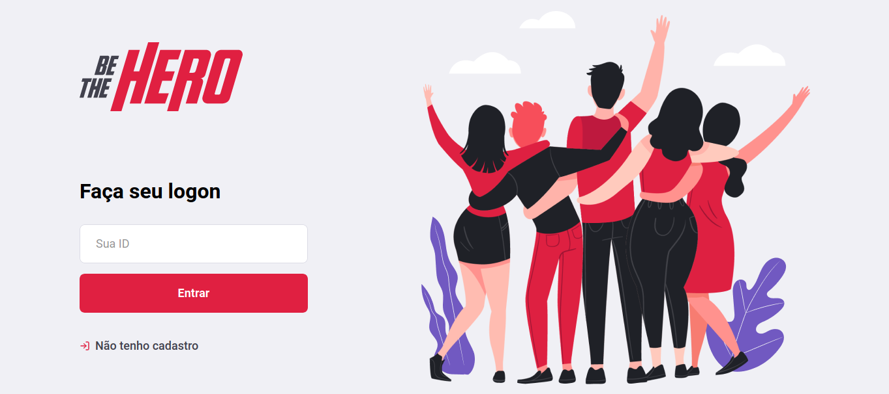
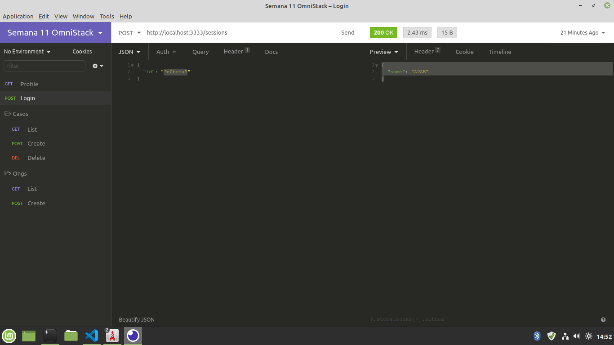

</img>

<h1 align="center">Semana Omnistack 11</h1>
<p align="center">Projeto <strong>BETHEHERO </strong> desenvolvido durante a Omnistack da Rocketseat</p>

<p align="center">
  <a aria-label="Versão do Node" href="https://github.com/nodejs/node/blob/master/doc/changelogs/CHANGELOG_V12.md#12.14.1">
    </img>
  </a>
  <a aria-label="Versão do React" href="https://github.com/facebook/react/blob/master/CHANGELOG.md#16120-november-14-2019">
    </img>
  </a>
  <a aria-label="Versão do Expo" href="https://www.npmjs.com/package/expo-cli/v/3.11.5">
    </img>
  </a>
  <a aria-label="Completo" href="https://rocketseat.com.br/week/aulas/11.0?aula=5">
    </img>
  </a>
</p>

## Instalação

Para instalar as dependências e executar o **Servidor** (modo desenvolvimento), clone o projeto em seu computador e em seguida execute:

```bash
cd backend
npm install
npm start
```

Para iniciar o **Frontend** do React utilize os comandos:

```bash
cd frontend
npm install
npm start
```

Assim que o processo terminar, automaticamente será aberta no seu navegador a página `localhost:3000` contendo o Projeto desenvolvido no dia 3 de 5.

Para testar o **Mobile** do React Native, primeiro coloque o endereço do seu servidor (ou computador) no arquivo `src/services/api.js`, e depois execute os comandos:

```bash
# NÃO é preciso executar a linha de baixo caso ja tenha o Expo (CLI) instalado!
npm install expo-cli --global
cd mobile
npm install
npm start
```

Assim que o processo terminar, automaticamente será aberta no seu navegador a página `localhost:19002`. Conecte seu emulador, ou teste o aplicativo por `LAN`: baixe o aplicativo _Expo_ da Play Store ou App Store e em seguida escaneie o código QR.

## Backend

Veja em [backend/README.md](./backend) para informações sobre o Backend e arquitetura.

## Frontend

Veja em [frontend/README.md](./frontend) para informações sobre o Frontend e os padrões. O Frontend foi desenvolvido no Dia 3 e ficou assim:

</img>
</img>
</img>

## Mobile

O App Mobile (React Native) desenvolvido no Dia 4 ficou assim:

</img>

## Imnsonia

Para testar a API do BeTHeHero, baixe e instale o [Insomnia](https://insomnia.rest/download/) e em seguida clique na Workspace → `Import/Export` →  
`Import Data` → `From File` → e selecione o arquivo `Insomnia_export.json` deste repositório. Assim que terminar, o resultado ficará assim:

</img>

## Licença

[MIT](./LICENSE) &copy; [Rocketseat](https://rocketseat.com.br/)
